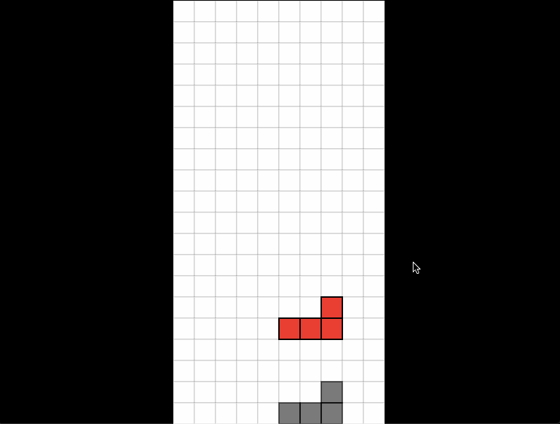

# RusTetris

This is my practice project for learning Rust programming language.



## Architecture of code
The game is mainly controlled by struct **Tetris**.

```rust
struct Tetris {
    nowPiece: Piece,        // now dropping piece
    backGround: Background,
}
```

```rust
#[derive(Copy, Clone, Debug)]
struct Piece {
    piece_type: i32,
    turn: i32,
    x: i32,
    y: i32,
    color: usize,
}
```


```rust
struct Background {
    record: [[bool; TETRIS_WIDTH]; TETRIS_HEIGHT],     // record the occupied block
    color_map: [[usize; TETRIS_WIDTH]; TETRIS_HEIGHT], // color code for each block
}
```
